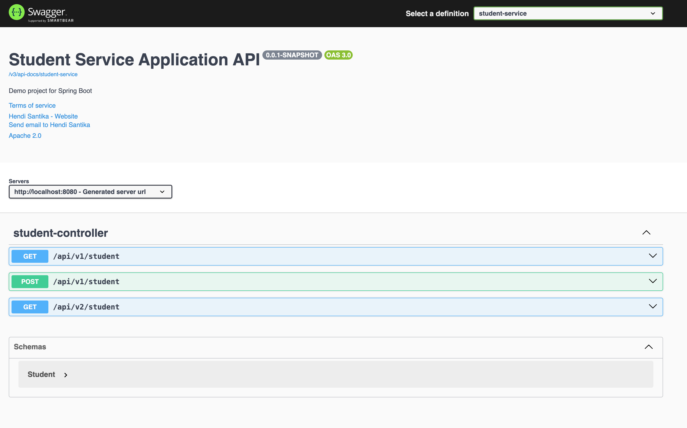

# springboot-mongodb-docker-compose-demo

### Things todo list:

1. Clone this repository: `git clone https://github.com/hendisantika/springboot-mongodb-docker-compose-demo.git`
2. Navigate to the folder: `cd springboot-mongodb-docker-compose-demo`
3. Run the application: `mvn clean spring-boot:run`
4. Open your favorite browser: http://localhost:8080/swagger-ui

### Image Screen shot

Swagger UI

